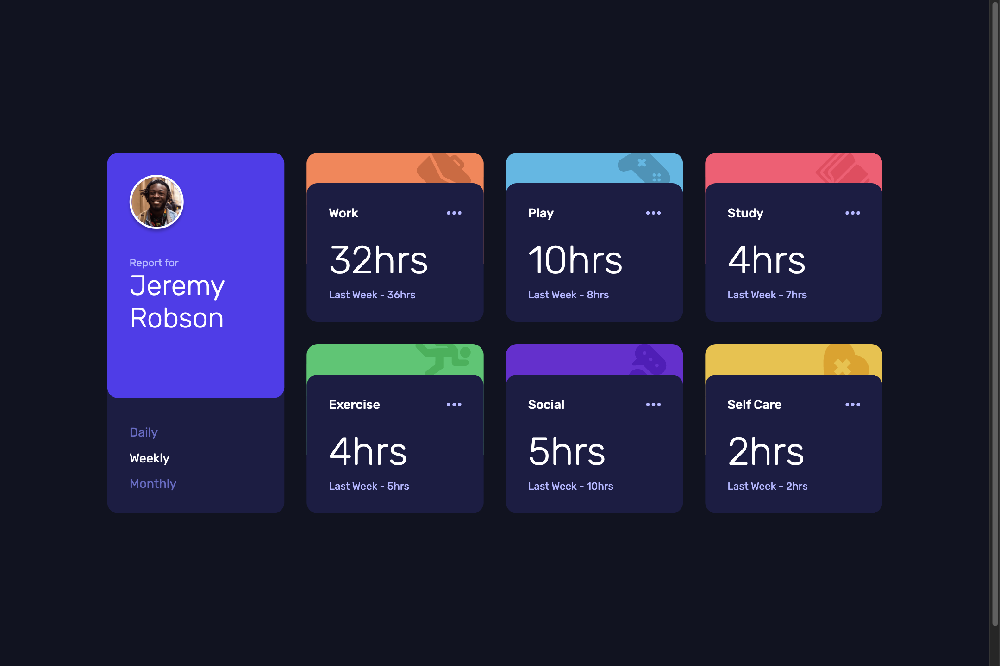

# FM - Time tracking dashboard Solution - Fraser Jubb

This is a solution to [this challenge on Frontend Mentor](https://www.frontendmentor.io/challenges/time-tracking-dashboard-UIQ7167Jw).

## 📖 Table of contents

- [Overview](#overview)
  - [Project Screenshot](#project-screenshot)
  - [Project Links](#project-links)
- [My Process](#my-process)
  - [Built With](#built-with)
  - [What I Learned](#what-i-learned)
  - [Continued Development](#continued-development)
  - [Useful Resources](#useful-resources)
- [Noteworthy Updates Since Initial Submission](#noteworthy-updates-since-initial-submission)
- [Connect With Me](#connect-with-me)

## Overview

### Project Screenshot



### Project Links

- Solution URL: [Click Here](INSERT URL HERE)
- Live Site URL: [Click Here](https://fm-timetrackingdashboard-fraser.netlify.app/)
- Frontend Mentor Profile: [@fraserjubb](https://www.frontendmentor.io/profile/fraserjubb)

## My Process

### Built With

- HTML
- CSS
- JavaScript
- Desktop-First Workflow

### What I Learned

In this particular project:

1. This was my first time working with any json files and using fetch requests. I opted to not use `async` in this instance for both practice and as it was only a simple json file.

2. I discovered that `toggle` also has a `force` parameter which essentially works as a Boolean. Useful for if wanting a condition to be met for it to be used.

```js
const previousLabels = {
  daily: 'Yesterday',
  weekly: 'Last Week',
  monthly: 'Last Month',
};

// Style Text
dailyBtn.classList.toggle('white-text', timeframe === 'daily');
weeklyBtn.classList.toggle('white-text', timeframe === 'weekly');
monthlyBtn.classList.toggle('white-text', timeframe === 'monthly');
```

3. I learned that CSS grid items can overlap one another. I don't yet have too much experience using grid so still fairly new to it. Useful to know!

### Continued Development

After submitting this project, I wish to develop the following:

1. Get more comfortable using fetch and css grid. It would just help to increase my speed. It will come with more practice and projects.

### Useful Resources

- [How to FETCH data from an API using JavaScript (YouTube Video)](https://www.youtube.com/watch?v=37vxWr0WgQk) - A nice and simple explanation of how fetch works with API.

## Noteworthy Updates Since Initial Submission

1. No major updates since submitted.

## Connect With Me

<a href="https://github.com/fraserjubb"></a>
<a href="https://www.linkedin.com/in/fraser-jubb"></a>
<a href="https://www.instagram.com/thejubbzone/"></a>
<a href="https://x.com/fraserjubb"></a>
<a href="https://www.youtube.com/@thejubbzone2374"></a>
<a href="mailto:fraserjubb.dev@gmail.com"></a>

<br/>
